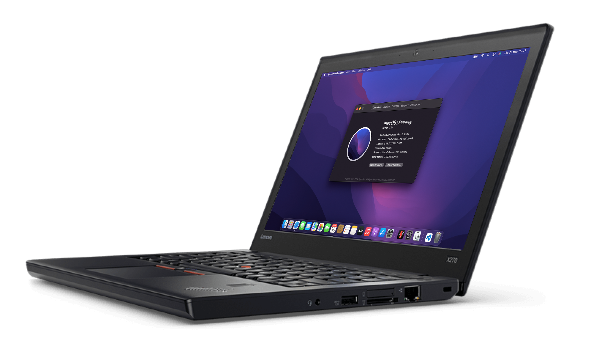
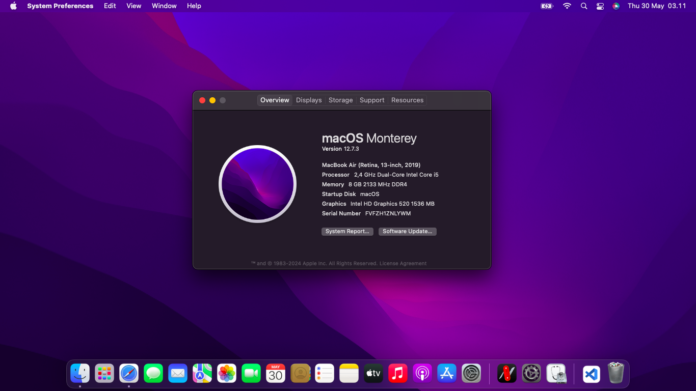

  
  <h2 align="center">Lenovo Thinkpad X270</h2>
  
OpenCore Config for Lenovo Thinkpad X270 with i5-6200U.

## Configuration
| Category | Details |
  |:--|:--|
  | CPU  | Intel(R) Core(TM) i5-6200U CPU @ 2.30GHz |
  | GPU | Intel HD Graphics 520 |
  | Network | Intel® Dual Band Wireless-AC 8260 |
  |  | Intel® Ethernet Connection I219-V |
  | Audio | Intel Sunrise Point-LP HD Audio |
  | Storage | BODI SSD 256GB |
  | Displays | 1224x768 - 13” |

## Boring Screenshot
  
 

>[!Warning]
> When installing or updating the system, be sure to make sure and replace some kext that matches your macOS version, otherwise, some components will not run properly.
 

## Bios settings

<b>Security</b>
- `Security Chip` **Disabled**
- `Memory Protection -> Execution Prevention` **Enabled**
- `Virtualization -> Intel Virtualization Technology` **Enabled**
- `Virtualization -> Intel VT-d Feature` **Enabled**
- `Anti-Theft -> Computrace -> Current Setting` **Disabled**
- `Secure Boot -> Secure Boot` **Disabled**
- `Intel SGX -> Intel SGX Control` **Disabled**
- `Device Guard` **Disabled**

<b>Startup</b>
- `UEFI/Legacy Boot` **UEFI Only**
- `CSM Support` **No**
